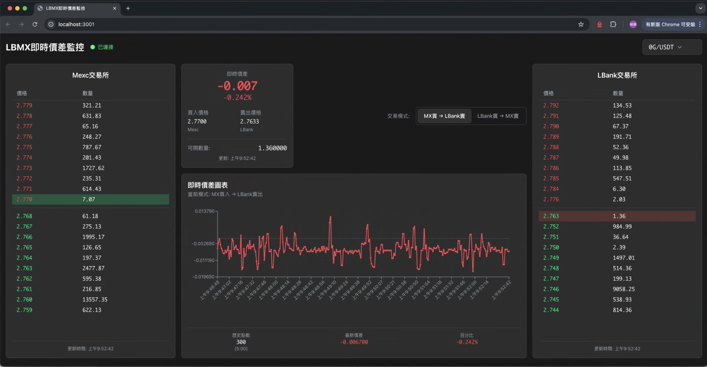

# 🚀 LBMX 即時價差監控系統

<div align="center">


**專為加密貨幣套利交易設計的即時價差監控工具**

同時監控 Mexc 與 LBank 交易所，實時計算價差，協助快速判斷建倉時機

[快速開始](#-快速部署) · [核心功能](#核心功能) · [技術架構](#技術架構) · [本地開發](#-本地開發)

</div>

## 介面



## 功能

### 核心功能

#### 1. 雙交易所即時監控
- **Mexc 交易所**：完整訂單簿數據，20檔深度
- **LBank 交易所**：完整訂單簿數據，20檔深度
- **每秒更新**：WebSocket 連接，低延遲數據推送
- **自動重連**：網絡斷線自動恢復

#### 2. 智能價差計算
- **雙向模式**：
  - 🟢 **Mexc 買入 → LBank 賣出**：顯示正套利機會
  - 🔴 **LBank 買入 → Mexc 賣出**：顯示反向套利機會
- **即時價差**：自動計算兩所價格差異
- **百分比顯示**：直觀的收益率展示
- **顏色標示**：正價差(綠)、負價差(紅)、零價差(灰)

#### 3. 智能高光提示
- **精準定位**：自動高光交易相關價位
- **Mexc 買模式**：高光 Mexc ask 最低價 + LBank bid 最高價
- **LBank 買模式**：高光 LBank ask 最低價 + Mexc bid 最高價
- **視覺化設計**：反色背景，易於識別

#### 4. 可開倉量計算
- **實時計算**：根據雙邊訂單簿深度
- **取較小值**：確保訂單可完全成交
- **動態精度**：根據幣種自動調整小數位

#### 5. 交易對篩選
- **智能過濾**：只顯示兩所共同支持的交易對
- **模糊搜索**：快速找到目標幣種
- **即時切換**：無需刷新頁面

### 數據可視化

- **即時線圖**：價差歷史走勢，最多 300 個數據點
- **專業配色**：暗色主題，降低眼睛疲勞
- **響應式布局**：適配各種螢幕尺寸
- **流暢動畫**：平滑的數據更新

## 技術架構

### 後端技術棧

```
FastAPI (Python 3.11)
├── aiohttp          # 異步 HTTP 客戶端
├── websockets       # WebSocket 服務
├── pydantic         # 數據驗證
└── uvicorn          # ASGI 服務器
```

**特點**：
- 高性能異步框架
- 自動 API 文檔（Swagger）
- WebSocket 實時推送
- 類型安全的數據模型

### 前端技術棧

```
React 18 + TypeScript
├── Recharts         # 圖表庫
├── Tailwind CSS     # 樣式框架
└── WebSocket API    # 實時通信
```

**特點**：
- 現代化 React Hooks
- 完整的 TypeScript 類型
- 響應式設計
- 組件化架構

### 部署架構

```
Internet
    ↓
Nginx (反向代理)
    ├─→ Frontend (靜態文件)
    ├─→ /api/* → Backend (FastAPI)
    └─→ /ws → WebSocket
```

**容器化支援**：
- Docker + Docker Compose
- 一鍵部署
- 自動重啟
- 健康檢查

## 🚀 快速部署

### Ubuntu 伺服器部署（推薦）

```bash
# 1. 克隆項目
cd /opt
git clone <your-repo-url> lbmx_rt_spread
cd lbmx_rt_spread

# 2. 執行自動部署腳本
chmod +x deploy.sh
sudo ./deploy.sh

# 3. 配置防火牆
sudo ufw allow 80/tcp
sudo ufw allow 443/tcp
sudo ufw allow 22/tcp
sudo ufw enable

# 4. 訪問應用
# http://your-server-ip
```

**一鍵部署腳本會自動：**
- 安裝 Docker 和 Docker Compose
- 構建所有服務容器
- 啟動應用程序
- 驗證服務健康狀態

## 💻 本地開發

### 前置需求

- Python 3.11+
- Node.js 18+
- Docker 和 Docker Compose（可選）

### 方式 1：Docker Compose（推薦）

```bash
# 構建並啟動所有服務
docker-compose up -d --build

# 查看日誌
docker-compose logs -f

# 停止服務
docker-compose down
```

訪問：
- 前端：http://localhost:80
- 後端 API 文檔：http://localhost:8001/docs
- 健康檢查：http://localhost:8001/api/health

### 方式 2：本地運行

#### 後端

```bash
# 安裝依賴
pip install -r requirements.txt

# 啟動後端
python run.py
```

後端將運行在：http://localhost:8001

#### 前端

```bash
# 進入前端目錄
cd frontend

# 安裝依賴
npm install

# 啟動開發服務器
npm start
```

前端將運行在：http://localhost:3001

## 項目結構

```
lbmx_rt_spread/
├── app/                        # 後端應用
│   ├── main.py                 # FastAPI 主程序
│   ├── models/                 # 數據模型
│   │   └── market_data.py      # 訂單簿、價差模型
│   └── services/               # 業務邏輯
│       ├── exchange_service.py # 交易所 API 服務
│       └── spread_calculator.py# 價差計算服務
├── frontend/                   # 前端應用
│   ├── public/                 # 靜態資源
│   ├── src/
│   │   ├── components/         # React 組件
│   │   │   ├── OrderBookComponent.tsx    # 訂單簿
│   │   │   ├── SpreadChart.tsx           # 價差圖表
│   │   │   ├── SpreadDisplay.tsx         # 價差顯示
│   │   │   ├── SymbolSearch.tsx          # 交易對搜索
│   │   │   ├── TradingModeToggle.tsx     # 模式切換
│   │   │   └── ConnectionStatus.tsx      # 連接狀態
│   │   ├── types/              # TypeScript 類型
│   │   └── App.tsx             # 主應用
│   ├── Dockerfile              # 前端容器配置
│   └── nginx.conf              # 前端 Nginx 配置
├── docker-compose.yml          # Docker Compose 配置
├── Dockerfile.backend          # 後端容器配置
├── nginx.conf                  # 主 Nginx 配置
├── requirements.txt            # Python 依賴
├── deploy.sh                   # 自動部署腳本
├── update.sh                   # 更新腳本
└── README.md                   # 本文檔
```

## 配置說明

### 環境變量

後端支持以下環境變量（可選）：

```bash
# .env 文件
PYTHONPATH=/app
PYTHONUNBUFFERED=1
```

### 端口配置

- **Nginx**：80（HTTP）、443（HTTPS）
- **後端**：8001（內部）
- **前端**：80（內部）

## API 文檔

部署後訪問 Swagger 文檔：

```
http://your-server-ip/api/docs
```

### 主要 API 端點

| 端點 | 方法 | 說明 |
|------|------|------|
| `/api/health` | GET | 健康檢查 |
| `/api/symbols` | GET | 獲取支持的交易對列表 |
| `/api/symbol` | POST | 切換當前交易對 |
| `/ws` | WebSocket | 實時市場數據推送 |

## 常用命令

### Docker 管理

```bash
# 查看服務狀態
docker-compose ps

# 查看日誌
docker-compose logs -f
docker-compose logs -f backend
docker-compose logs -f frontend

# 重啟服務
docker-compose restart
docker-compose restart backend

# 停止服務
docker-compose down

# 重新構建並啟動
docker-compose up -d --build

# 進入容器
docker-compose exec backend bash
docker-compose exec frontend sh
```

### 更新部署

```bash
# 使用更新腳本（推薦）
./update.sh

# 或手動更新
git pull
docker-compose down
docker-compose up -d --build
```

### 清理資源

```bash
# 清理未使用的容器和鏡像
docker system prune -a

# 清理構建緩存
docker builder prune
```

## 🔒 安全建議

### 生產環境檢查清單

- [ ] 配置防火牆，只開放必要端口
- [ ] 使用 HTTPS（Let's Encrypt）
- [ ] 定期更新系統和依賴
- [ ] 設置自動備份
- [ ] 監控資源使用
- [ ] 定期檢查日誌
- [ ] 限制容器資源使用
- [ ] 使用強密碼和密鑰認證

### 推薦的安全實踐

```bash
# 配置防火牆
sudo ufw allow 80/tcp
sudo ufw allow 443/tcp
sudo ufw allow 22/tcp
sudo ufw default deny incoming
sudo ufw enable

# 設置自動更新
sudo apt install unattended-upgrades
sudo dpkg-reconfigure -plow unattended-upgrades
```

## 📈 性能優化

### 建議的優化措施

1. **CDN 加速**：將靜態資源託管到 CDN
2. **Redis 緩存**：緩存交易對列表
3. **負載均衡**：高流量時使用多個後端實例
4. **數據庫**：添加 PostgreSQL 持久化歷史數據
5. **監控**：使用 Prometheus + Grafana 監控

### 資源限制配置

編輯 `docker-compose.yml` 添加資源限制：

```yaml
services:
  backend:
    deploy:
      resources:
        limits:
          cpus: '1'
          memory: 512M
```

## 🐛 故障排除

### 常見問題

**Q: 無法訪問網站？**
```bash
# 檢查服務狀態
docker-compose ps

# 檢查端口是否監聽
sudo netstat -tulpn | grep :80

# 檢查防火牆
sudo ufw status
```

**Q: WebSocket 連接失敗？**
```bash
# 查看後端日誌
docker-compose logs -f backend

# 確認 Nginx 配置
docker-compose exec nginx cat /etc/nginx/nginx.conf
```

**Q: 價差數據不更新？**
```bash
# 檢查交易所 API 連接
docker-compose logs backend | grep "交易對數量"

# 重啟後端服務
docker-compose restart backend
```

**Q: 前端顯示等待數據？**
```bash
# 檢查 WebSocket 連接
# 打開瀏覽器開發者工具 > Network > WS

# 檢查後端是否正常廣播
docker-compose logs backend | grep "廣播數據"
```

## License

MIT License - 詳見 [LICENSE](LICENSE) 文件

## 🤝 貢獻

歡迎提交 Issue 和 Pull Request！

1. Fork 本倉庫
2. 創建特性分支 (`git checkout -b feature/AmazingFeature`)
3. 提交更改 (`git commit -m 'Add some AmazingFeature'`)
4. 推送到分支 (`git push origin feature/AmazingFeature`)
5. 開啟 Pull Request

## 📞 支持

- **Issues**: [GitHub Issues](https://github.com/andyuan997/lbmx_rt_spread/issues)
- **文檔**: 查看 `/api/docs` 獲取 API 文檔

## ⚠️ 免責聲明

本工具僅供學習和研究使用。加密貨幣交易存在風險，使用本工具進行交易的任何損失，開發者不承擔任何責任。請謹慎投資，理性交易。

<div align="center">

**如果這個項目對你有幫助，請給個 ⭐️ Star！**

Made with ❤️ by andyuan997

</div>

